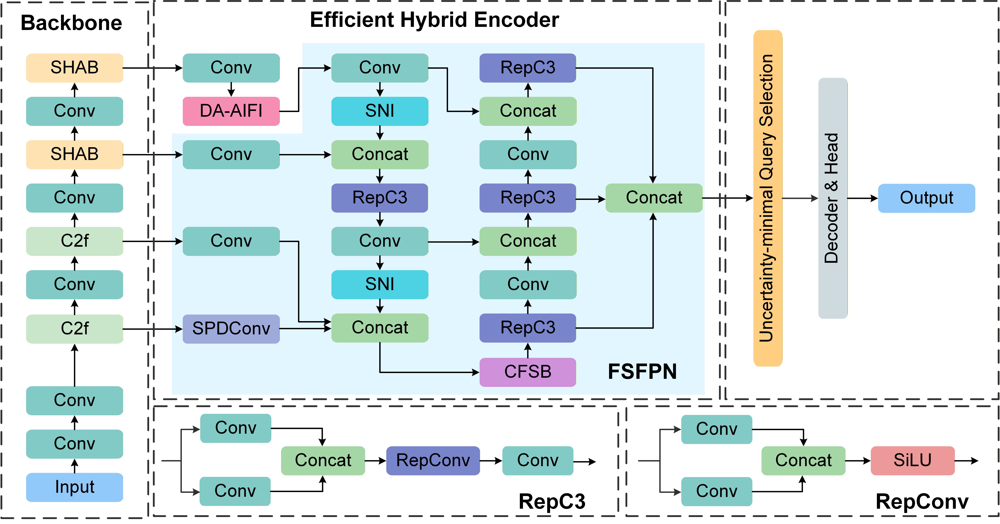
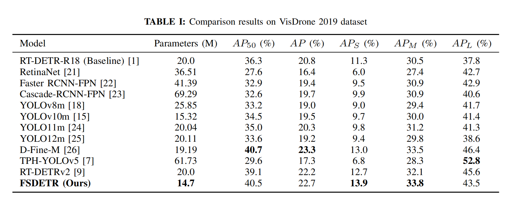

# FSDETR: Frequency-Spatial Feature Enhancement for Small Object Detection
**Jianchao Huang, Fengming Zhang, Haibo Zhu and Tao Yan\***

> Abstract—Small object detection remains a significant challenge due to feature degradation from downsampling, mutual occlusion in dense clusters, and complex background interference. To address these issues, this paper proposes FSDETR, a frequency–spatial feature enhancement framework built upon the RT-DETR baseline. By establishing a collaborative modeling mechanism, the method effectively leverages complementary structural information. Specifically, a Spatial Hierarchical Attention Block (SHAB) captures both local details and global dependencies to strengthen semantic representation. Furthermore, to mitigate occlusion in dense scenes, the Deformable Attention-based Intra-scale Feature Interaction (DA-AIFI) focuses on informative regions via dynamic sampling. Finally, the Frequency-Spatial Feature Pyramid Network (FSFPN) integrates frequency filtering with spatial edge extraction via the Crossdomain Frequency-Spatial Block (CFSB) to preserve fine-grained details. Experimental results show that with only 14.7M parameters, FSDETR achieves 13.9% APS on VisDrone 2019 and 48.95% AP50 tiny on TinyPerson, showing strong performance on small-object benchmarks. 

## Preprint URL
This paper has been accepted by IJCNN 2026. The prepring URL is: https://arxiv.org/abs/2604.14884

## Network Architecture

## Quantitative Comparisons

## APs Comparisons

